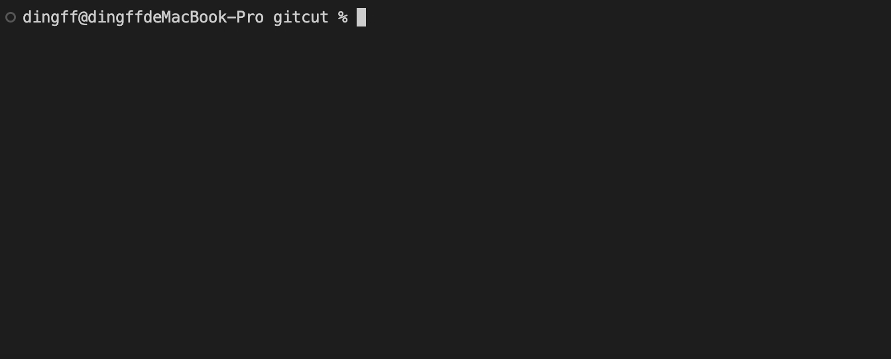

# gitcut

Simplify multiple git commands into one.



## Install
```
npm install -g gitcut
```

## Usage
### --init
Generate configuration file.
```
gt --init
```
### query
Pull from a specified repository. You can directly use it like this:
```
gt query <remoteUrl> <branch> [paths]
```
Or use alias, which needs to be configured in the configuration file.
```
gt query <alias>
```
If the remote repository has already been added, you can use its name instead of the url. For example, if you have already added a remote repository named origin, you can use it like this:
```
gt query origin <branch> [paths]
```
And also you can use interactive mode.
```
gt query
```
To exclude some paths in a directory, try adding `!` before the path.
### submit
Submit all changes in the workspace. Following the [commitlint-config-conventional](https://github.com/conventional-changelog/commitlint/tree/master/@commitlint/config-conventional#type-enum) types, emoji will be automatically added to the commit message. All you need to do is enable it in the configuration file, as it is turned off by default.
```
gt submit <msg>
```
### bh
Create a branch and push it to remote.
```
gt bh
```
### cp
Simplify cherry-pick.
```
gt cp
```
### mg
Merge any branch interactively.
```
gt mg
```
In addition, gt is compatible with all git commands 🎉🎉🎉.